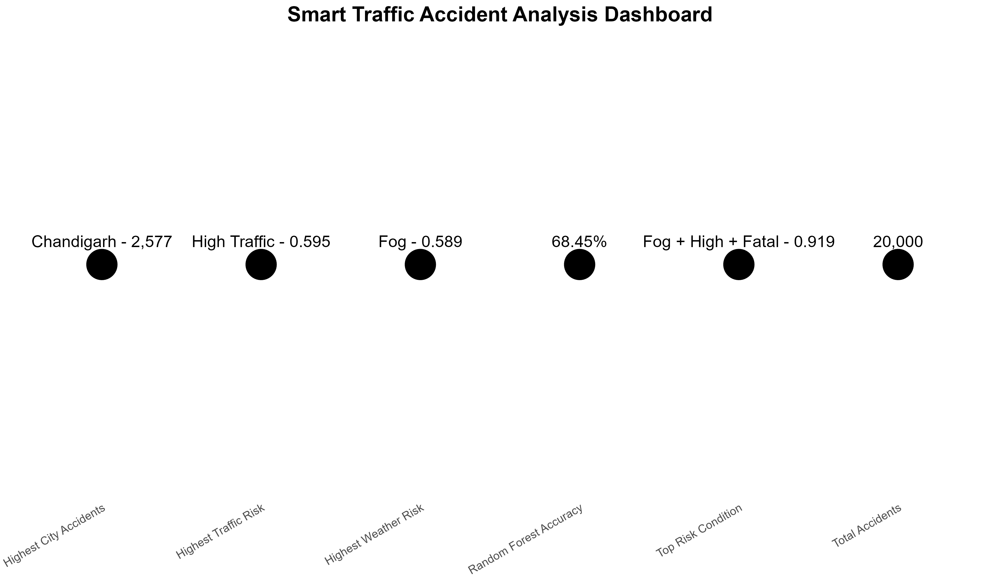

Yes bro 👍 I understand. You want the **complete README.md**, keeping the **Analysis Workflow** and adding **everything important from our project**—EDA, risk analysis, all visualizations, ML, results, dashboard, reports, limitations, and Smart Traffic 2.0 roadmap.

Use this as the **final README.md**:

````markdown
# 🚦 Smart Accident Visualization

### Road Accident Analysis, Risk Assessment, Visualization & Machine Learning

Smart Accident Visualization is a data-driven road accident analysis project developed using **R**. The project analyzes **20,000 accident records** to identify accident patterns, severity trends, geographical hotspots, weather and traffic relationships, accident risk conditions, and accident severity using machine learning.

The project combines **data cleaning, exploratory data analysis, risk analysis, visualization, machine learning, model evaluation, and dashboard development** to transform accident data into meaningful road-safety insights.

---

## 📌 Project Overview

Road accidents are influenced by several factors, including:

- Weather conditions
- Traffic density
- Accident causes
- Location
- Time of accident
- Number of vehicles involved
- Number of casualties
- Accident severity

This project analyzes these factors to identify patterns and conditions associated with higher accident risk.

The project includes:

- 📊 Exploratory Data Analysis
- 🏙️ City-wise accident analysis
- ⏰ Hour-wise accident analysis
- 📅 Year-wise accident analysis
- 🌦️ Weather analysis
- 🚗 Traffic-density analysis
- ⚠️ Risk-score analysis
- 🚨 Accident severity analysis
- 📍 Traffic hotspot analysis
- 🔍 Cause and severity analysis
- 🤖 Random Forest classification
- 📈 Logistic Regression classification
- 🌳 Feature importance analysis
- 📊 Model comparison
- 🖥️ Smart Traffic dashboard
- 📄 HTML report
- 📑 PDF report

---

# 🎯 Project Objectives

The main objectives of this project are:

1. Analyze road accident patterns.
2. Identify cities with the highest accident counts.
3. Analyze accident severity distribution.
4. Study accident patterns across different hours.
5. Analyze year-wise accident trends.
6. Study the relationship between weather and accident risk.
7. Analyze the effect of traffic density on accident risk.
8. Identify high-risk weather and traffic combinations.
9. Analyze accident causes and severity.
10. Identify traffic accident hotspots.
11. Build machine learning models for accident severity prediction.
12. Compare Random Forest and Logistic Regression.
13. Evaluate model performance using accuracy, precision, recall, and F1-score.
14. Identify important predictive features.
15. Create a consolidated Smart Traffic dashboard.
16. Generate complete HTML and PDF project reports.

---

# 🛠️ Technologies Used

| Technology | Purpose |
|------------|---------|
| **R** | Data analysis and machine learning |
| **RStudio** | Development environment |
| **Tidyverse** | Data manipulation and analysis |
| **dplyr** | Data transformation |
| **ggplot2** | Data visualization |
| **randomForest** | Random Forest classification |
| **R Markdown** | Report generation |
| **HTML** | Interactive report presentation |
| **PDF / LaTeX** | Final report generation |
| **Git** | Version control |
| **GitHub** | Project hosting |

---

# 📊 Dataset

The project analyzes:

> **20,000 road accident records**

The dataset contains information related to accident characteristics such as:

- City
- Location
- Weather
- Traffic density
- Accident cause
- Accident severity
- Risk score
- Casualties
- Vehicles involved
- Date
- Hour
- Other accident-related attributes

The dataset is used for both exploratory analysis and machine learning.

---

# 🔄 Analysis Workflow

The complete project follows the workflow below:

```text
                    Accident Dataset
                           │
                           ↓
                    Data Inspection
                           │
                           ↓
                     Data Cleaning
                           │
                           ↓
                Data Transformation
                           │
                           ↓
              Exploratory Data Analysis
                           │
          ┌────────────────┼────────────────┐
          ↓                ↓                ↓
       City Analysis   Weather Analysis  Traffic Analysis
          │                │                │
          └────────────────┼────────────────┘
                           ↓
                     Risk Analysis
                           │
          ┌────────────────┼────────────────┐
          ↓                ↓                ↓
     Severity Analysis  Cause Analysis  Hotspot Analysis
          │                │                │
          └────────────────┼────────────────┘
                           ↓
                    Data Visualization
                           │
                           ↓
                  Feature Preparation
                           │
                           ↓
                   Train/Test Split
                           │
                           ↓
                  Machine Learning
                     /           \
                    /             \
                   ↓               ↓
          Random Forest     Logistic Regression
                   \               /
                    \             /
                     ↓           ↓
                   Model Evaluation
                           │
                           ↓
                   Model Comparison
                           │
                           ↓
                  Dashboard Creation
                           │
                           ↓
                 HTML & PDF Reporting
````

---

# 🧹 Data Preparation

Before analysis and modelling, the dataset was prepared through several steps:

* Dataset inspection
* Variable identification
* Data cleaning
* Missing-value checking
* Data transformation
* Categorical variable preparation
* Feature selection
* Target variable preparation
* Training and testing dataset creation

The machine learning data was divided into:

```text
Training Data: 80%
Testing Data: 20%
```

---

# 🔬 Exploratory Data Analysis

Exploratory Data Analysis was performed to understand accident patterns across different dimensions.

The analysis included:

* City
* Severity
* Weather
* Traffic density
* Year
* Hour
* Accident cause
* Risk score
* Casualties
* Vehicles involved

---

# 🏙️ City Analysis

City-level analysis was performed to identify locations with the highest number of accidents.

### Highest Accident Count

**Chandigarh — 2,577 accidents**


---

# ⚠️ Accident Severity Analysis

The dataset contains three accident severity categories:

| Severity  | Accident Count |
| --------- | -------------: |
| Minor     |         11,025 |
| Major     |          5,988 |
| Fatal     |          2,987 |
| **Total** |     **20,000** |

### Observations

* Minor accidents were the most common.
* Major accidents formed the second-largest category.
* Fatal accidents represented the smallest category.
* Fatal accidents showed substantially higher risk characteristics.


---

# ⏰ Hour-wise Accident Analysis

Accident patterns were analyzed across different hours of the day.

This helps identify periods with higher accident frequency and understand how accident severity changes throughout the day.


### Severity by Hour


---

# 📅 Year-wise Accident Analysis

Year-wise analysis was performed to understand how accident counts changed over time.


---

# 🌦️ Weather Analysis

Weather conditions were analyzed to understand their relationship with accident risk.

### Highest Average Risk Weather

> **Fog — 0.589 average risk**


### Accidents by Weather


Weather conditions were incorporated into the overall accident-risk analysis.

---

# 🚗 Traffic Density Analysis

Traffic density was analyzed to understand its relationship with accident risk.

### Highest Average Risk Traffic Condition

> **High traffic density — 0.595 average risk**

The analysis indicates that traffic density is an important factor to consider when evaluating accident risk.

---

# ⚠️ Risk Analysis

Risk scores were analyzed across different accident conditions.

The analysis included:

* Risk score distribution
* Risk by weather
* Risk by traffic density
* Risk by severity
* Weather and traffic combinations

### Risk Score Distribution


### Risk by Weather


### Accidents by Risk Level


---

# 🚨 Highest-Risk Condition

The highest-risk combination identified in the analysis was:

| Weather | Traffic  | Severity  | Average Risk |
| ------- | -------- | --------- | -----------: |
| **Fog** | **High** | **Fatal** |    **0.919** |

This represents the highest average-risk combination identified in the project.


---

# 🛣️ Accident Cause Analysis

Accident causes were analyzed to understand their relationship with accident severity.

The analysis considered causes such as:

* Distraction
* Drunk driving
* Overspeeding
* Poor road
* Weather

### Cause vs Severity


This analysis helps understand which causes are associated with different accident severity levels.

---

# 📍 Traffic Hotspot Analysis

The project also performs hotspot analysis to identify locations with high accident concentration.

The highest identified hotspot contained approximately:

> **636 accidents**

The hotspot was approximately around:

```text
Latitude: 30.7
Longitude: 76.8
```


---

# 🚗 Vehicle and Casualty Analysis

The project examines the relationship between vehicles involved and casualties.

| Vehicles Involved | Accident Count | Avg. Casualties | Avg. Risk |
| ----------------: | -------------: | --------------: | --------: |
|                 1 |          4,030 |           0.573 |     0.438 |
|                 2 |          4,030 |            1.16 |     0.437 |
|                 3 |          4,007 |            1.71 |     0.434 |
|                 4 |          3,936 |            2.31 |     0.445 |
|                 5 |          3,997 |            2.90 |     0.435 |

The average number of casualties increased as the number of vehicles involved increased.

---

# 🤖 Machine Learning

Machine learning was used to predict:

> **Accident Severity**

The target variable contains:

```text
fatal
major
minor
```

Two classification models were developed:

1. **Random Forest**
2. **Logistic Regression**

---

# 🌳 Random Forest

The Random Forest classifier was trained using:

```text
Number of Trees: 300
Training Data: 80%
Testing Data: 20%
Importance: Enabled
```

### Random Forest Accuracy

> **68.45%**

---

# 🔲 Random Forest Confusion Matrix

The test-set confusion matrix was:

| Actual / Predicted | Fatal | Major | Minor |
| ------------------ | ----: | ----: | ----: |
| Fatal              |   587 |     0 |     6 |
| Major              |     0 |    51 | 1,180 |
| Minor              |     1 |    81 | 2,094 |


---

# 🌳 Random Forest Feature Importance

Feature importance was calculated to identify variables contributing to the Random Forest predictions.


Additional Random Forest variable importance:


---

# 📉 Random Forest Error Rate

The Random Forest error rate was evaluated across the trees.


---

# 📈 Logistic Regression

Logistic Regression was developed as a baseline classification model.

The evaluated model achieved:

> **68.45% accuracy**

A Logistic Regression confusion matrix is also included:


---

# 🏆 Model Comparison

| Model                   |   Accuracy |
| ----------------------- | ---------: |
| **Random Forest**       | **68.45%** |
| **Logistic Regression** | **68.45%** |


Both evaluated models achieved the same overall accuracy.

---

# 🎯 Classification Performance

The Random Forest model produced the following class-level performance:

| Severity | Precision | Recall |   F1 Score |
| -------- | --------: | -----: | ---------: |
| Minor    |    63.84% | 96.88% | **76.96%** |
| Major    |    39.64% |  3.57% |  **6.56%** |
| Fatal    |    99.83% | 98.82% | **99.32%** |

---

# 🧠 Model Interpretation

## Fatal Accidents

Fatal accidents were identified extremely effectively.

> **F1 Score: 99.32%**

The model achieved very high precision and recall for fatal accidents.

---

## Minor Accidents

Minor accidents achieved high recall:

> **Recall: 96.88%**

This means the model successfully identified most actual minor accidents.

---

## Major Accidents

Major accidents were considerably more difficult to classify.

> **F1 Score: 6.56%**

The low recall indicates that many actual major accidents were classified as minor.

This is an important limitation of the current machine-learning model.

---

# 📊 Confusion Matrix Visualizations

The project includes model evaluation visualizations.

### General Confusion Matrix


### Random Forest


### Logistic Regression


---

# 🖥️ Smart Traffic Dashboard

A consolidated Smart Traffic dashboard was created to present important project findings.

The dashboard combines:

* Accident statistics
* Severity
* Weather
* Traffic
* Risk
* Machine learning results
* Key insights



---

# 📊 Project Visualizations

The project generates multiple visualizations.

| Visualization             | Purpose                           |
| ------------------------- | --------------------------------- |
| Accidents by City         | Identify accident-prone cities    |
| Accidents by Hour         | Analyze hourly patterns           |
| Accidents by Risk Level   | Understand risk distribution      |
| Accidents by Severity     | Analyze severity distribution     |
| Accidents by Weather      | Analyze weather-related accidents |
| Accidents by Year         | Identify yearly trends            |
| Cause Severity            | Analyze cause vs severity         |
| Confusion Matrix          | Evaluate classification           |
| Feature Importance        | Identify important features       |
| Model Accuracy Comparison | Compare models                    |
| RF Error Rate             | Analyze model error               |
| Risk by Weather           | Compare weather risk              |
| Risk Score Distribution   | Analyze risk scores               |
| Severity by Hour          | Analyze hourly severity           |
| Traffic Hotspots          | Identify accident hotspots        |
| Weather Risk              | Analyze weather risk              |
| Weather Traffic Risk      | Analyze combined risk             |

---

# 📁 Project Structure

```text
Smart-Traffic-Accident-Visualization/
│
├── README.md
│
├── R/
│   ├── data_analysis.R
│   ├── visualization.R
│   ├── machine_learning.R
│   └── dashboard.R
│
├── data/
│   └── dataset files
│
├── images/
│   ├── accidents_by_city.png
│   ├── accidents_by_hour.png
│   ├── accidents_by_risk_level.png
│   ├── accidents_by_severity.png
│   ├── accidents_by_weather.png
│   ├── accidents_by_year.png
│   ├── cause_severity.png
│   ├── confusion_matrix.png
│   ├── feature_importance.png
│   ├── logistic_confusion_matrix.png
│   ├── model_accuracy_comparison.png
│   ├── rf_confusion_matrix.png
│   ├── rf_error_rate.png
│   ├── rf_variable_importance.png
│   ├── risk_by_weather.png
│   ├── risk_score_distribution.png
│   ├── severity_by_hour.png
│   ├── smart_traffic_dashboard.png
│   ├── traffic_hotspots.png
│   ├── weather_risk.png
│   ├── weather_traffic_risk.png
│   └── ...
│
├── outputs/
│   └── visualizations/
│
├── results/
│   ├── best_model.csv
│   ├── cause_severity.csv
│   ├── classification_metrics.csv
│   ├── confusion_matrix.csv
│   ├── feature_importance.csv
│   ├── logistic_accuracy.csv
│   ├── logistic_confusion_matrix.csv
│   ├── logistic_regression_model.txt
│   ├── model_accuracy.csv
│   ├── model_comparison.csv
│   ├── random_forest_model.txt
│   ├── risk_analysis.csv
│   └── weather_traffic_risk.csv
│
├── final_report.html
│
└── final_report.pdf
```

---

# 📂 Results Directory

The `results/` directory contains exported outputs from the analysis and machine-learning stages.

Important files include:

* `best_model.csv`
* `cause_severity.csv`
* `classification_metrics.csv`
* `confusion_matrix.csv`
* `feature_importance.csv`
* `logistic_accuracy.csv`
* `logistic_confusion_matrix.csv`
* `model_accuracy.csv`
* `model_comparison.csv`
* `random_forest_model.txt`
* `logistic_regression_model.txt`
* `risk_analysis.csv`
* `weather_traffic_risk.csv`

---

# 📄 Reports

The project includes two complete report formats.

## 🌐 HTML Report

```text
final_report.html
```

The HTML report provides a browser-based presentation of the project analysis, results, and visualizations.

## 📑 PDF Report

```text
final_report.pdf
```

The PDF report provides a printable version of the complete analysis.

---

# 📌 Final Findings

## 🏙️ City

Highest accident count:

> **Chandigarh — 2,577 accidents**

---

## ⚠️ Severity

Most common severity:

> **Minor — 11,025 accidents**

---

## 🌦️ Weather

Highest average weather risk:

> **Fog — 0.589**

---

## 🚗 Traffic

Highest average traffic risk:

> **High — 0.595**

---

## 🚨 Highest Risk Condition

> **Fog + High Traffic + Fatal**

Average risk:

> **0.919**

---

## 🤖 Machine Learning

Random Forest accuracy:

> **68.45%**

Logistic Regression accuracy:

> **68.45%**

---

## 🎯 Best Class Performance

Fatal accident F1-score:

> **99.32%**

Minor accident F1-score:

> **76.96%**

Major accident F1-score:

> **6.56%**

---

# 💡 Key Insights

### 1. Accident concentration

Chandigarh recorded the highest number of accidents in the analyzed dataset.

### 2. Severity distribution

Minor accidents were the most common accident category.

### 3. Weather risk

Fog showed the highest average weather-related risk.

### 4. Traffic risk

High traffic density showed the highest average traffic-related risk.

### 5. Combined risk

The combination of fog, high traffic, and fatal severity produced the highest average risk.

### 6. Machine learning

Both evaluated classification models achieved 68.45% accuracy.

### 7. Fatal accidents

Fatal accidents were classified extremely effectively.

### 8. Major accidents

Major accidents remained difficult for the current models to classify accurately.

---

# ⚠️ Limitations

The current Smart Accident Visualization 1.0 system has several limitations:

* The project is based on the available historical accident dataset.
* The current system is primarily an offline analysis system.
* Accident severity classes are not evenly distributed.
* Major accident classification performance is low.
* The current system does not use live traffic data.
* The current system does not use live weather data.
* Real-time accident reporting is not implemented.
* The current dashboard is based on analyzed dataset information rather than continuously updating live feeds.

---

# 🚀 Future Development — Smart Traffic 2.0

The next version can transform the current analytical project into a more advanced real-time traffic safety platform.

## 🌦️ Real-Time Weather

Integrate live weather information to dynamically calculate accident risk.

---

## 🚗 Real-Time Traffic

Integrate real-time traffic-density information to continuously update risk levels.

---

## 🗺️ Interactive Risk Map

Develop an interactive map displaying:

* Accident hotspots
* Current traffic
* Weather conditions
* Risk levels
* Predicted accident severity

---

## 🤖 Real-Time Risk Prediction

Use machine learning to generate real-time accident-risk predictions based on current environmental and traffic conditions.

---

## 🚨 Automated Alerts

Generate warnings when high-risk conditions are detected.

Example:

```text
⚠️ HIGH RISK DETECTED

Weather: Fog
Traffic: High
Risk: 0.91

Recommendation:
Increase driver awareness and reduce speed.
```

---

## 📊 Live Dashboard

Future versions can include a continuously updating dashboard containing:

* Current traffic density
* Current weather
* Current risk score
* Predicted severity
* High-risk locations
* Accident hotspots
* Historical trends

---

## 📱 Web Application

The system can be converted into an interactive web application using technologies such as:

* Shiny
* R
* JavaScript
* APIs
* Interactive mapping

---

## ☁️ Cloud Deployment

Future versions could be deployed online so that the dashboard can be accessed remotely.

---

# 🔮 Smart Traffic Roadmap

```text
┌─────────────────────────────┐
│     SMART TRAFFIC 1.0       │
├─────────────────────────────┤
│ Historical Accident Data    │
│ Data Cleaning               │
│ Exploratory Analysis        │
│ Risk Analysis               │
│ Visualizations              │
│ Hotspot Analysis            │
│ Random Forest               │
│ Logistic Regression         │
│ Dashboard                   │
│ HTML Report                 │
│ PDF Report                  │
└──────────────┬──────────────┘
               │
               ↓
┌─────────────────────────────┐
│     SMART TRAFFIC 2.0       │
├─────────────────────────────┤
│ Real-Time Weather           │
│ Real-Time Traffic           │
│ Live Risk Prediction        │
│ Interactive Risk Map        │
│ Automated Alerts            │
│ Live Dashboard              │
│ Web Application             │
│ Cloud Deployment            │
└─────────────────────────────┘
```

---

# 📚 Project Outputs

The repository contains:

* 📊 Data analysis scripts
* 📈 Statistical results
* 📉 Visualization outputs
* 🌦️ Weather analysis
* 🚗 Traffic analysis
* ⚠️ Risk analysis
* 📍 Hotspot analysis
* 🤖 Random Forest model
* 📊 Logistic Regression model
* 🎯 Classification metrics
* 🌳 Feature importance
* 🖥️ Smart Traffic dashboard
* 🌐 HTML report
* 📑 PDF report

---

# 👩‍💻 Author

## Harshitha

GitHub:

[https://github.com/vemalaharshitha](https://github.com/vemalaharshitha)

---

# 📌 Project Information

| Property             | Details                                       |
| -------------------- | --------------------------------------------- |
| **Project Name**     | Smart Accident Visualization                  |
| **Version**          | 1.0                                           |
| **Domain**           | Data Science / Road Safety / Machine Learning |
| **Language**         | R                                             |
| **Dataset Size**     | 20,000 accident records                       |
| **Machine Learning** | Random Forest & Logistic Regression           |
| **Best Accuracy**    | 68.45%                                        |
| **Fatal F1 Score**   | 99.32%                                        |
| **Minor F1 Score**   | 76.96%                                        |
| **Major F1 Score**   | 6.56%                                         |

---

# 📜 License

This project is intended for educational, academic, research, and portfolio purposes.

---

# ⭐ Smart Accident Visualization

> **Turning accident data into meaningful insights for smarter and safer traffic management.**

---
